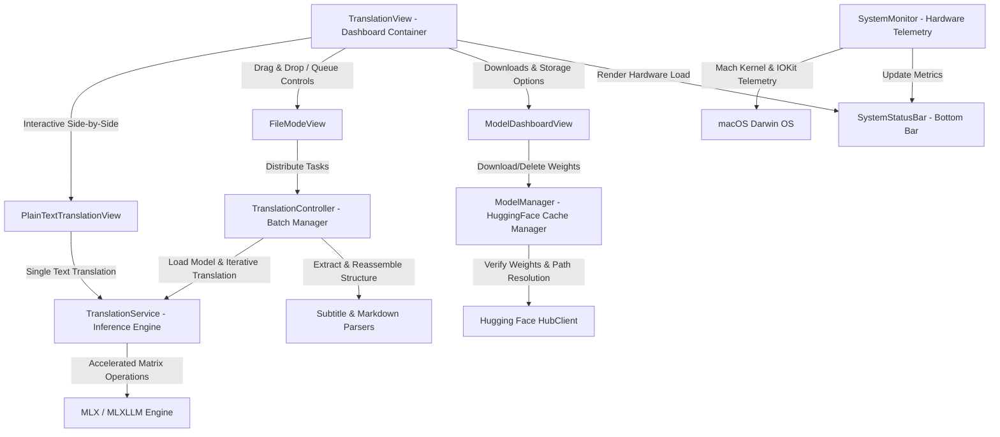

# TranslateGemma

[](https://developer.apple.com/macos/)
[](https://swift.org)
[](#license)

**TranslateGemma** is a premium, privacy-first macOS application designed for high-performance, local offline translation. Powered by **Google's TranslateGemma** large language models and optimized via Apple's **MLX Machine Learning Framework**, TranslateGemma delivers lightning-fast translation directly on your Apple Silicon hardware without ever sending your data to the cloud.

The application features a breathtaking **glassmorphic design language** tailored for macOS Sonoma/Sequoia, offering premium visual aesthetics alongside advanced tools for subtitle translating, Markdown formatting preservation, and real-time hardware telemetry.

---

## 📸 Architecture & Data Flow



---

## ✨ Key Features

### 1. Local Offline Inference Engine (`TranslationService`)
*   **Hardware Acceleration**: Harnesses Apple Silicon's unified memory architecture and Metal GPU acceleration via the `mlx-swift` framework for blazing-fast matrix calculations.
*   **GPU Kernel Prewarming**: Back-ground compiles and pre-heats GPU kernels upon app launch via `prewarm()`, completely eliminating the initial latency stutter when translating your first text fragment.
*   **Dynamic Cache Scheduling**: Raises MLX's system cache limit to **95%** of physical memory during active generation for maximum throughput, then instantly scales it down to a conservative **50%** to release VRAM and memory.
*   **Prefill Optimization**: Dynamically scales the `prefillStepSize` parameter based on model capacity (64 for 27B, 128 for 12B, and 256 for 4B) to maximize compute occupancy.

### 2. Auto-Unload & Battery Protection (Saver Mode)
*   **State-Aware Memory Management**: Employs an AppKit application state observer to detect background transitions (`didResignActiveNotification`) or **10 minutes** of idle inactivity. The active LLM is automatically unloaded, and all unified memory/VRAM is immediately reclaimed via `MLX.Memory.clearCache()`, protecting notebook battery life.

### 3. Side-by-Side Plain Text Translation (`PlainTextTranslationView`)
*   **Flicker-Free Streaming Append**: Features a bridged AppKit `NSTextView` ([NativeTextEditor](Sources/TranslateGemmaKit/UI/Components/NativeTextEditor.swift)) that bypasses full SwiftUI block invalidations during LLM streaming. It performs direct **Append Diff** injections on the underlying `textStorage` to provide a perfectly smooth text flow with no screen flicker.
*   **Smart Scrolling Lock**: Tracks your cursor viewport. Automatically scrolls to the bottom if your view is anchored near the generation end, but preserves your viewport position if you scroll up to inspect previous translations.
*   **Text Splitter Chunking**: Integrates a regular expression-backed [TextSplitter](Sources/TranslateGemmaKit/Utilities/TextSplitter.swift) that cuts input blocks into safe 1,500-character segments at sentence/paragraph boundaries to prevent LLM context blowouts.

### 4. Advanced File Batch Queue (`FileModeView`)
*   **Native Drag & Drop Ingestion**: Instantly drop multiple files into the main dashboard. The app automatically enters File Mode with smooth spring-damped layout transitions.
*   **Precise Time Estimation (ETA)**: Calculates ETA based on exact **translatable character counts** rather than raw file sizes (which contain non-translatable headers, styles, or timestamp blocks), ensuring highly reliable progress statistics.
*   **Individual Task customisation**: Select and modify target and source languages on a *per-file* basis within the queue, rather than locking the entire batch to a single global language pair.
*   **Bulk Actions Capsule Bar**: Multi-select queue cards to prompt a gorgeous floating bulk actions toolbar to update target languages or remove tasks simultaneously.

### 5. Format-Preserving Parsers (`Utilities`)
*   **`MarkdownParser` (Formatting Guard)**: Segments files into `text` (translatable strings), `code` (untranslated code fences), and `syntax` (# headers, tables, blockquotes). Inline styles (like `` `code` ``, links, images, and HTML tags) are extracted into non-translatable tags (`<ph id="x"/>`) before inference, and swapped back post-translation to **guarantee Markdown rendering and URLs are never corrupted**.
*   **`ASSParser` (Substation Alpha)**: Decodes ASS timeline declarations, parses fields dynamically according to the `Format:` directive, splits dialogue fields safely while keeping nested comma strings, separates comment tracks, and exports the final translation with all graphical styling and positions fully intact.
*   **`SRTParser` & `VTTParser`**: Handles standard subtitle blocks with strict regular expressions to validate and preserve all timestamps, arrow markers, positions, and VTT `NOTE` declarations.

### 6. Hugging Face Cache Manager (`ModelManager`)
*   **Multi-Quantization Discovery**: Supports downloading and managing three quantised MLX community model configurations:
    *   `translategemma-4b-it-4bit` (2.2 GB) — Ideal for low-memory setups.
    *   `translategemma-12b-it-4bit` (6.7 GB) — Balanced performance and accuracy.
    *   `translategemma-27b-it-4bit` (15.2 GB) — Production-grade translation accuracy.
*   **Legacy & Modern Path Resolver**: Intelligently verifies cache assets across legacy `models/` layouts and modern HuggingFace `models--/snapshots/` hashing, validating weights and tokenizers.
*   **Self-Healing Downloader Sniffer**: Launches a 0.5s timer that queries all active session tasks on the downloader session, forcing UI updates with high-fidelity bandwidth speeds even if default download handlers suffer from stream hiccups.
*   **Custom Storage Drive Routing**: Lets you select custom storage routes (e.g., an external SSD) via a native `NSOpenPanel` sheet to free up internal storage.

### 7. Darwin System Telemetry (`SystemMonitor`)
*   Accesses low-level system page counters (`vm_statistics64`), CPU tick changes (`HOST_CPU_LOAD_INFO`), and Metal device utilization dictionaries (`IOAccelerator` service registries) to draw real-time telemetry metrics in the bottom status indicator.

---

## 📂 Project Structure

```text
.
├── .github/workflows/         # CI/CD workflows for automated release DMGs
├── Sources/
│   ├── BatchTest/             # CLI utility for CI environment pipeline tests
│   ├── TranslateGemmaApp/     # Main macOS app bundle targets & Info plist
│   └── TranslateGemmaKit/     # Core Library target
│       ├── Configuration/     # App persistence & directory cache rules
│       ├── Services/          # MLX inference, downloading, telemetry & queue control
│       ├── Utilities/         # Subtitle, Markdown parsers, splitter & language managers
│       ├── UI/
│       │   ├── Styles/        # Button styles & interactions
│       │   └── Components/    # Native editors, statuses, pickers, liquid Metal gradients
│       └── Features/          # Top-level SwiftUI Dashboards (Plain Text, File Mode, Model Library)
├── Tests/                     # Comprehensive Unit & Integration test coverage
├── Package.swift              # Swift Package Manager Manifest definition
└── build_dmg.sh               # macOS native compiler, Metal packager & signing tool
```

---

## 🛠️ Prerequisites

*   **Operating System**: macOS 14.0 (Sonoma) or newer.
*   **Architecture**: Apple Silicon Mac (M1, M2, M3, M4 family) is highly recommended for Metal Unified Memory acceleration.
*   **Developer SDK**: Xcode 15.3+ / Swift 5.10+.

---

## 🚀 Getting Started

### Clone the Repository
```bash
git clone https://github.com/ericclose/TranslateGemmaApp.git
cd TranslateGemmaApp
```

### Open in Xcode
Open the folder directly as a Swift Package:
```bash
open Package.swift
```

### Running Local Verification Tests
Ensure all subtitle and Markdown parsers, cache directories, and integration flows compile and pass successfully:
```bash
swift test
```

---

## 📦 Building for Production (DMG Installer)

To package a standalone `.app` bundle, compile all required `.metal` shader files into a unified `default.metallib`, clean Xcode RPATHs, sign the bundle with Hardened Runtime entitlements, and package it into a compressed, read-only `.dmg` disk image:

Run the native build script from your terminal:
```bash
chmod +x build_dmg.sh
./build_dmg.sh 1.0.0
```

Once completed, a high-fidelity build time summary is displayed, and the resulting installer is generated in your project root:
`TranslateGemmaApp-arm64-v1.0.0.dmg`

---

## 🛡️ Entitlements & Sandboxing

TranslateGemmaApp implements strict Sandboxing rules inside [TranslateGemmaApp.entitlements](Sources/TranslateGemmaApp/Resources/TranslateGemmaApp.entitlements):
*   `com.apple.security.app-sandbox`: Enabled.
*   `com.apple.security.files.user-selected.read-write`: Enabled (for user file imports & export selections).
*   `com.apple.security.network.client`: Enabled (required to download models from Hugging Face).

---

## 📄 License

This project is licensed under the MIT License - see the LICENSE file for details.
Gemma and TranslateGemma weights are distributed under the Google Gemma Terms of Use.
